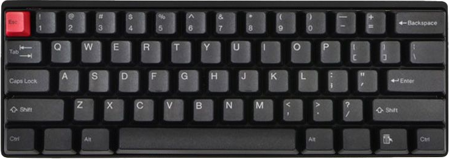
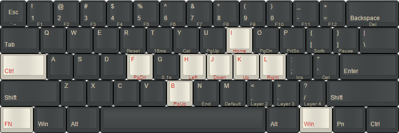
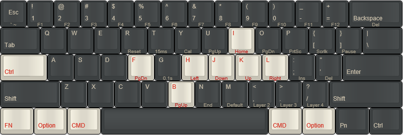

# WASD VP3 Keyboard Layouts

## Table of Contents

- [Introduction](#introduction)
- [Tips & Tricks](#tips--tricks)
- [Programming Instructions](#programming-instructions)
- [Layer 2 (Red) for Linux/Windows](#layer-2-red-for-linuxwindows)
- [Layer 3 (Green) for macOS](#layer-3-green-for-macos)
- [Layer 4 (Blue) for Additional Customizations](#layer-4-blue-for-additional-customizations)
- [Common Bindings](#common-bindings)
- [Move Fn to L_Ctrl](#move-fn-to-l_ctrl)
- [Sources](#sources)
   
## Introduction

This document contains helpful hints and layout improvements for users of the popular [WASD VP3](https://www.wasdkeyboards.com/) mechanical keyboard. The layouts work with Linux, Windows, and macOS.

> **Note:** Some of the programming instructions are inspired by the POK3R, but have been adapted for the WASD VP3.

Source to buy one:

- [WASD Keyboards](https://www.wasdkeyboards.com/wasd-vp3-61-key-doubleshot-pbt-black-slate-mechanical-keyboard.html)

The following layers are used:

- Linux/Windows: Layer 2 (red LED), switch to it with: `Fn + ,<`
- macOS: Layer 3 (green LED), switch with: `Fn + .>`
- Additional: Layer 4 (blue LED), switch with: `Fn + /?`

## Tips & Tricks

- Toggle arrow-keys on `R_Shift`, `Fn`, `Pn`, and `R_Ctrl`: `L_Win + R_Alt + Space`
- Factory reset: Hold `L_Alt + R_Alt` keys for five seconds, until the LED under the spacebar stops flashing.
- Reset selected layer only: `Fn + R` until LED under the spacebar stops flashing.

> [WASD VP3 Quick Reference Guide](docs/vp3_quick_reference_guide.pdf) for more details on resetting and programming.

## Programming Instructions

When the keyboard is in programming mode, the second LED (right-hand side of the space bar) will light up. It starts blinking when you start programming a key and will turn off only when you exit programming mode.

- Default layer (`Fn+M`) cannot be programmed.
- Enter programming mode: `Fn + R_Ctrl`, second LED under space bar lights up.
  - Press `key to program`, second LED under spacebar will now blink.
  - Enter `new content`, up to 32 characters.
  - Confirm with `Pn`, the second LED will stop blinking.
- Exit programming: `Fn + R_Ctrl`, second LED goes dark.

> **Note:** During programming, use the keys as labeled on the keyboard, irrespective of any reassignments.

## Layer 2 (Red) for Linux/Windows

`Fn + ,<` to switch to Layer 2 (Red LED).

- [Move Fn to L_Ctrl](#move-fn-to-l_ctrl)
- `Fn + R_Ctrl` to enter programming.
- [Common bindings](#common-bindings).
- `Fn + R_Ctrl` to exit programming.

Resulting programming:

  
Linux/Windows Layout on [keyboard-layout-editor.com](<http://www.keyboard-layout-editor.com/##@_name=Pok3r%20Layer%202%20for%20Windows&author=davidjenni&notes=See%20%5Bgithub%5D(https%2F:%2Fgithub.com%2Fdavidjenni%2Fpok3r-layouts)>)

## Layer 3 (Green) for macOS

`Fn + .>` to switch to Layer 3 (Green LED).

- [Move Fn to L_Ctrl](#move-fn-to-l_ctrl).
- `Fn + R_Ctrl` to enter programming.
- [Common bindings](#common-bindings).
- Swap Cmd/Opt keys on both sides of the space bar:
  - L_Cmd: `L_Alt` then `L_WIN` then `Pn`
  - L_Option: `L_WIN` then `L_Alt` then `Pn`
  - R_Cmd: `R_Alt` then `R_Fn` (Win) then `Pn`
  - R_Option: `R_Fn` (Win) then `R_Alt` then `Pn`.
- `Fn + R_Ctrl` to exit programming.

Resulting programming:

  
macOS Layout on [keyboard-layout-editor.com](<http://www.keyboard-layout-editor.com/##@_name=Pok3r%20Layer%203%20for%20OSX%2F%2FMac&author=davidjenni&notes=See%20%5Bgithub%5D(https%2F:%2Fgithub.com%2Fdavidjenni%2Fpok3r-layouts)>)

## Layer 4 (Blue) for Additional Customizations

`Fn + /?` to switch to Layer 4 (Blue LED).

This layer can be used for any additional custom keybindings or specialized functions. Similar to Layers 2 and 3, it can be programmed using `Fn + R_Ctrl` to enter programming mode.

## Common Bindings

Enter programming mode first.

- CapsLock always as Ctrl:
  - `CapsLock` then `L_Ctrl` then `Pn` to confirm.
  - `Fn + CapsLock` then `L_Ctrl` then `Pn` to confirm.
- VI/VIM style HJKL for arrow keys and Page Up/Down:
  - Left: `Fn + H` then `Fn + J` then `Pn`.
  - Down: `Fn + J` then `Fn + K` then `Pn`.
  - Up: `Fn + K` then `Fn + I` then `Pn`.
  - PgDown: `Fn + F` then `Fn + O` then `Pn`.
  - PgUp: `Fn + B` then `Fn + U` then `Pn`.
- Home: `Fn + I` then `Fn + H` then `Pn`.
- Volume controls:
  - Mute: `Fn + X` then `Fn + /?` then `Pn`.
  - Vol-: `Fn + C` then `Fn + ,<` then `Pn`.
  - Vol+: `Fn + V` then `Fn + .>` then `Pn`.

Remember to exit programming mode to activate changes. See each respective OS section above.

## Move Fn to L_Ctrl

For better ergonomics while using the VI/VIM style HJKL as cursor keys, move the Fn key to the left Ctrl key location. Instead of entering programming mode, use the DIP switch:

- Switch to Layer 2 (or 3, 4); this programming is per layer.
- Unplug keyboard.
- DIP switch 4 to ON.
- Plug in keyboard again, then press `Fn` then `L_Ctrl` then `Pn` (to leave it in its original location).
- DIP switch 4 back to OFF (no need to unplug).

## Sources

The how-to for these mappings is from several resources:

- [WASD VP3 Quick Reference Guide](docs/vp3_quick_reference_guide.pdf)
- [r/mk: HowTo program pok3r](http://www.reddit.com/r/MechanicalKeyboards/comments/35uy60/guide_howto_program_your_pok3r_programming_layers/)
- [r/mk: HowTo media controls pok3r](http://www.reddit.com/r/MechanicalKeyboards/comments/37j3sx/guide_modification_pok3r_media_volume_controls_hw/)

##
 This work is licensed under a <a rel="license" href="http://creativecommons.org/licenses/by-sa/4.0/">Creative Commons Attribution-ShareAlike 4.0 International License</a>.
